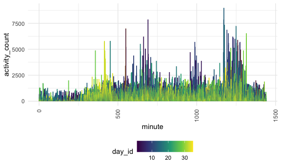
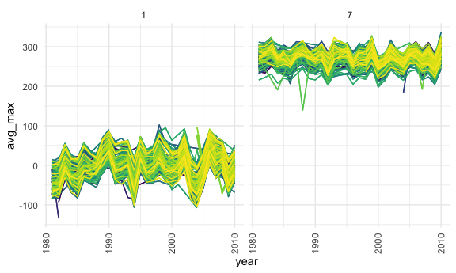

Homework 3
================
Diana Sanchez

This is my solution to HW3.

## Problem 1

``` r
data("instacart")
```

This dataset contains 1384617 rows and 15 columns.

Observations are the level of items in orders by user. There are user /
order variables (user ID, order ID, order day, and order hour). There
are also item variables (name, aisle, department, and some numeric
codes).

### How many aisles, and which are most items from? The following code counts the number of times an aisle is listed and orders it from largest to smallest number.

``` r
instacart %>% 
    count(aisle) %>% 
    arrange(desc(n))
```

    ## # A tibble: 134 x 2
    ##    aisle                              n
    ##    <chr>                          <int>
    ##  1 fresh vegetables              150609
    ##  2 fresh fruits                  150473
    ##  3 packaged vegetables fruits     78493
    ##  4 yogurt                         55240
    ##  5 packaged cheese                41699
    ##  6 water seltzer sparkling water  36617
    ##  7 milk                           32644
    ##  8 chips pretzels                 31269
    ##  9 soy lactosefree                26240
    ## 10 bread                          23635
    ## # … with 124 more rows

There are 134 aisles and the one where most items are from is fresh
vegetables.

### Make a plot that shows the number of items ordered in each aisle, limiting this to aisles with more than 10000 items ordered. Arrange aisles sensibly, and organize your plot so others can read it.

The following code creates a plot, organizes the x-axis labels, reorders
the x-axis points according to n from smallest to largest.

``` r
instacart %>% 
    count(aisle) %>% 
    filter(n > 10000) %>% 
    mutate(
        aisle = factor(aisle),
        aisle = fct_reorder(aisle, n)
    ) %>% 
    ggplot(aes(x = aisle, y = n)) + 
    geom_point() + 
    theme(axis.text.x = element_text(angle = 270, vjust = 0.5, hjust = 1))
```


### Make a table showing the three most popular items in each of the aisles “baking ingredients”, “dog food care”, and “packaged vegetables fruits”. Include the number of times each item is ordered in your table.

``` r
instacart %>% 
    filter(aisle %in% c("baking ingredients", "dog food care", "packaged vegetables fruits")) %>% 
    group_by(aisle) %>% 
    count(product_name) %>%
    mutate(rank = min_rank(desc(n))) %>% 
    filter(rank < 4) %>% 
    arrange(aisle, rank) %>% 
    knitr::kable()
```

| aisle                      | product\_name                                 |    n | rank |
| :------------------------- | :-------------------------------------------- | ---: | ---: |
| baking ingredients         | Light Brown Sugar                             |  499 |    1 |
| baking ingredients         | Pure Baking Soda                              |  387 |    2 |
| baking ingredients         | Cane Sugar                                    |  336 |    3 |
| dog food care              | Snack Sticks Chicken & Rice Recipe Dog Treats |   30 |    1 |
| dog food care              | Organix Chicken & Brown Rice Recipe           |   28 |    2 |
| dog food care              | Small Dog Biscuits                            |   26 |    3 |
| packaged vegetables fruits | Organic Baby Spinach                          | 9784 |    1 |
| packaged vegetables fruits | Organic Raspberries                           | 5546 |    2 |
| packaged vegetables fruits | Organic Blueberries                           | 4966 |    3 |

### Make a table showing the mean hour of the day at which Pink Lady Apples and Coffee Ice Cream are ordered on each day of the week; format this table for human readers (i.e. produce a 2 x 7 table).

``` r
instacart %>% 
    filter(product_name %in% c("Pink Lady Apples", "Coffee Ice Cream")) %>% 
    group_by(product_name, order_dow) %>% 
    summarize(mean_hour = mean(order_hour_of_day)) %>% 
    pivot_wider(
        names_from = order_dow,
        values_from = mean_hour
    ) %>%
knitr::kable()
```

    ## `summarise()` regrouping output by 'product_name' (override with `.groups` argument)

| product\_name    |        0 |        1 |        2 |        3 |        4 |        5 |        6 |
| :--------------- | -------: | -------: | -------: | -------: | -------: | -------: | -------: |
| Coffee Ice Cream | 13.77419 | 14.31579 | 15.38095 | 15.31818 | 15.21739 | 12.26316 | 13.83333 |
| Pink Lady Apples | 13.44118 | 11.36000 | 11.70213 | 14.25000 | 11.55172 | 12.78431 | 11.93750 |

## Problem 2

### Load, tidy, and otherwise wrangle the data. Your final dataset should include all originally observed variables and values; have useful variable names; include a weekday vs weekend variable; and encode data with reasonable variable classes. Describe the resulting dataset (e.g. what variables exist, how many observations, etc).

``` r
accel_df =
  read_csv(
    "./data/accel_data.csv") %>%
  pivot_longer(
    activity.1:activity.1440,
    names_to = "minute",
    names_prefix = "activity.",
    values_to = "activity_count"
  ) %>%
  group_by(day) %>%
  mutate(
    day_type = case_when(
    day %in% c("Monday","Tuesday","Wednesday","Thursday","Friday") ~ "weekday",
    day %in% c("Saturday","Sunday") ~ "weekend")) %>%
  mutate(
    day = factor(day, levels = c("Monday", "Tuesday", "Wednesday", "Thursday", "Friday", "Saturday", "Sunday"))) %>%
  mutate(
    week = factor(week, levels = c(1:5)),
    minute = as.numeric(minute))
```

    ## Parsed with column specification:
    ## cols(
    ##   .default = col_double(),
    ##   day = col_character()
    ## )

    ## See spec(...) for full column specifications.

This dataset contains 50400 rows/observations and 6 columns. Variables
in this data set include week, day\_id, day, minute, activity\_count,
and day\_type.

### Traditional analyses of accelerometer data focus on the total activity over the day. Using your tidied dataset, aggregate across minutes to create a total activity variable for each day, and create a table showing these totals. Are any trends apparent?

``` r
accel_df %>%
  group_by(day_id, week, day) %>%
  summarise(
    total_activity = (sum(activity_count))) %>%
  arrange(day) %>%
  arrange(week) %>%
  knitr::kable()
```

    ## `summarise()` regrouping output by 'day_id', 'week' (override with `.groups` argument)

| day\_id | week | day       | total\_activity |
| ------: | :--- | :-------- | --------------: |
|       2 | 1    | Monday    |        78828.07 |
|       6 | 1    | Tuesday   |       307094.24 |
|       7 | 1    | Wednesday |       340115.01 |
|       5 | 1    | Thursday  |       355923.64 |
|       1 | 1    | Friday    |       480542.62 |
|       3 | 1    | Saturday  |       376254.00 |
|       4 | 1    | Sunday    |       631105.00 |
|       9 | 2    | Monday    |       295431.00 |
|      13 | 2    | Tuesday   |       423245.00 |
|      14 | 2    | Wednesday |       440962.00 |
|      12 | 2    | Thursday  |       474048.00 |
|       8 | 2    | Friday    |       568839.00 |
|      10 | 2    | Saturday  |       607175.00 |
|      11 | 2    | Sunday    |       422018.00 |
|      16 | 3    | Monday    |       685910.00 |
|      20 | 3    | Tuesday   |       381507.00 |
|      21 | 3    | Wednesday |       468869.00 |
|      19 | 3    | Thursday  |       371230.00 |
|      15 | 3    | Friday    |       467420.00 |
|      17 | 3    | Saturday  |       382928.00 |
|      18 | 3    | Sunday    |       467052.00 |
|      23 | 4    | Monday    |       409450.00 |
|      27 | 4    | Tuesday   |       319568.00 |
|      28 | 4    | Wednesday |       434460.00 |
|      26 | 4    | Thursday  |       340291.00 |
|      22 | 4    | Friday    |       154049.00 |
|      24 | 4    | Saturday  |         1440.00 |
|      25 | 4    | Sunday    |       260617.00 |
|      30 | 5    | Monday    |       389080.00 |
|      34 | 5    | Tuesday   |       367824.00 |
|      35 | 5    | Wednesday |       445366.00 |
|      33 | 5    | Thursday  |       549658.00 |
|      29 | 5    | Friday    |       620860.00 |
|      31 | 5    | Saturday  |         1440.00 |
|      32 | 5    | Sunday    |       138421.00 |

I cannot see a clear overall trend, but I did notice that the two lowest
total activity counts were both on Saturdays.

### Accelerometer data allows the inspection activity over the course of the day. Make a single-panel plot that shows the 24-hour activity time courses for each day and use color to indicate day of the week. Describe in words any patterns or conclusions you can make based on this graph.

``` r
accel_df %>%
ggplot(aes(x = minute, y = activity_count, color = day_id), aplpha= 0.5) + 
    geom_line() + 
    theme(axis.text.x = element_text(angle = 90, vjust = 0.5, hjust = 1))
```



## Problem 3

### Do some data cleaning. Create separate variables for year, month, and day. Ensure observations for temperature, precipitation, and snowfall are given in reasonable units. For snowfall, what are the most commonly observed values? Why?

Loading data

``` r
data("ny_noaa")
ny_noaa = ny_noaa %>%
  separate(date, into = c("year", "month", "day"), convert = TRUE)
```

Tidying data

``` r
ny_noaa_snow_count = ny_noaa %>%
  count(snow) %>% 
    arrange(desc(n))
```

The most commonly observed values for snowfall are “0 mm” with a count
of 2008508 and “NA” with a count of 381221. They are followed by “25 mm”
with a count of 31022 and “13 mm” with a count of 23095.

### Make a two-panel plot showing the average max temperature in January and in July in each station across years. Is there any observable / interpretable structure? Any outliers?

``` r
ny_noaa_jan_jul_tmax_clean = ny_noaa %>%
  filter(month == 1 | month == 7) %>%
  filter(!is.na(tmax)) %>%
  mutate(
    tmax = as.numeric(tmax),
    month = as.factor(month)
  )

tmax_ave_jan_jul = 
  ny_noaa_jan_jul_tmax_clean %>%
  group_by(month,year, id) %>%
  summarise(avg_max = mean(tmax))
```

    ## `summarise()` regrouping output by 'month', 'year' (override with `.groups` argument)

``` r
tmax_ave_jan_jul %>% 
  ggplot(aes(x = year, y = avg_max, color = id), alpha = 0.5) + 
    geom_line() + 
    theme(axis.text.x = element_text(angle = 90, vjust = 0.5, hjust = 1)) +
    facet_wrap(~month) +
  viridis::scale_fill_viridis(discrete = TRUE)
```



### Make a two-panel plot showing (i) tmax vs tmin for the full dataset (note that a scatterplot may not be the best option); and (ii) make a plot showing the distribution of snowfall values greater than 0 and less than 100 separately by year.
